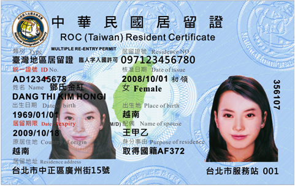

<aside class="callout" aria-label="說明">

請注意

我不是律師，也沒有任何法律實務經驗。本文不構成法律意見。文中所有內容均來自我自行研究，未經任何法律專業人士審閱或查證。在依據本文任何資訊採取行動以前，請查閱所附來源，確認相關敘述正確無誤。

</aside>

**在台灣歸化**，是外國人或無國籍人取得中華民國國籍的法律程序。《國籍法》除承認因血統取得國籍，以及在特定情況下因出生取得國籍之外，也將歸化列為取得中華民國國籍的依據。<a href="#ref-1" aria-label="參考資料 1">[1]</a> 歸化業務由內政部主管，主要受《國籍法》及《國籍法施行細則》規範。<a href="#ref-1" aria-label="參考資料 1">[1]</a><a href="#ref-2" aria-label="參考資料 2">[2]</a> 依一般歸化途徑，申請人通常須在台灣連續五年，每年合法居留至少 183 日，並須符合行為能力、素行、經濟自立、基本語言能力，以及國民權利義務基本常識等要件。<a href="#ref-1" aria-label="參考資料 1">[1]</a> 中華民國國民的配偶及部分前配偶、與台灣有特定親屬關係者、符合資格的高級專業人才，以及有殊勳於中華民國者等數類申請人，則適用較寬鬆的要件或得免除部分要件。<a href="#ref-1" aria-label="參考資料 1">[1]</a><a href="#ref-3" aria-label="參考資料 3">[3]</a><a href="#ref-4" aria-label="參考資料 4">[4]</a>

歸化與戶籍登記是兩套不同的法律程序。內政部許可歸化時，當事人即取得中華民國國籍；但新歸化者在尚未設立戶籍以前，屬於臺灣地區無戶籍國民（以下簡稱無戶籍國民）。<a href="#ref-1" aria-label="參考資料 1">[1]</a><a href="#ref-5" aria-label="參考資料 5">[5]</a> 這類國民必須另依《入出國及移民法》辦理居留與定居，之後才能設立戶籍並取得申領國民身分證的資格。<a href="#ref-6" aria-label="參考資料 6">[6]</a><a href="#ref-5" aria-label="參考資料 5">[5]</a>

除法律另有豁免規定外，外國人歸化後，必須在一年內提出喪失原有國籍證明。<a href="#ref-1" aria-label="參考資料 1">[1]</a> 現行制度通常是在中華民國國籍獲准後，才辦理喪失原有國籍；這項程序順序由 2016 年通過的修法確立，起因是過去曾有申請人先放棄原有國籍，最後卻未能取得中華民國國籍，因而成為無國籍人。<a href="#ref-3" aria-label="參考資料 3">[3]</a><a href="#ref-7" aria-label="參考資料 7">[7]</a> 台灣的歸化制度自 2000 年《國籍法》全面修正以來，曾多次改革；其中 2016 年與 2024 年的大幅修法，放寬了部分外籍配偶、高級專業人才、無國籍兒童及其他申請人的要件。<a href="#ref-8" aria-label="參考資料 8">[8]</a><a href="#ref-3" aria-label="參考資料 3">[3]</a><a href="#ref-4" aria-label="參考資料 4">[4]</a> 歸化政策，尤其是婚姻移民的待遇、放棄原有國籍與取得雙重國籍等議題，也一直是學術研究與公共討論的對象。<a href="#ref-9" aria-label="參考資料 9">[9]</a><a href="#ref-7" aria-label="參考資料 7">[7]</a><a href="#ref-10" aria-label="參考資料 10">[10]</a>

[TOC]

## 要件
一般歸化要件規定於《國籍法》第 3 條；外國人或無國籍人具備下列各款要件者，得申請歸化：<a href="#ref-1" aria-label="參考資料 1">[1]</a><a href="#ref-2" aria-label="參考資料 2">[2]</a>

* 現於中華民國領域內有住所
* 於中華民國領域內，每年合計有 183 日以上合法居留的事實，且連續五年以上
* 依中華民國法律及其本國法均有行為能力
* 無不良素行，且無警察刑事紀錄證明的刑事案件紀錄
* 有相當的財產或專業技能，足以自立，或生活保障無虞
* 具備我國基本語言能力及國民權利義務基本常識

### 例外規定
《國籍法》另為與中華民國有特定親屬關係、具有特定出生或居留關係、具高級專業人才資格、有殊勳，以及隨同歸化的未成年子女等申請人，提供不同的歸化途徑。除非條文明文免除某項要件，依第 4 條及第 5 條申請者仍須符合第 3 條中適用的各項要件。<a href="#ref-1" aria-label="參考資料 1">[1]</a>

#### 配偶及特定親屬關係（第 4 條第 1 項）
外國人或無國籍人現於中華民國領域內有住所，並連續三年，每年在台灣合法居留至少 183 日者，得依第 4 條第 1 項申請歸化。除另有規定外，申請人仍須符合第 3 條有關行為能力、素行、經濟自立，以及語言能力與國民權利義務基本常識的要件。<a href="#ref-1" aria-label="參考資料 1">[1]</a>

中華民國國民的配偶不須符合財產或足以自立的要件，但仍須符合第 3 條其他適用要件。<a href="#ref-1" aria-label="參考資料 1">[1]</a>

下列人士也可適用相同的三年居留途徑：

* 曾為中華民國國民配偶，因受家庭暴力離婚且未再婚；
* 中華民國國民的未再婚生存配偶，且有事實足認與亡故配偶的親屬仍有往來；但配偶死亡前婚姻關係已存續二年以上者，不受此限制；
* 對無行為能力或限制行為能力的中華民國國籍子女，有扶養事實、行使或負擔權利義務，或會面交往；
* 父或母現為或曾為中華民國國民；
* 為中華民國國民的養子女；
* 出生於中華民國領域內；或
* 為中華民國國民的監護人或輔助人。<a href="#ref-1" aria-label="參考資料 1">[1]</a><a href="#ref-2" aria-label="參考資料 2">[2]</a>

#### 未婚未成年人（第 4 條第 2 項）
未婚且未滿 18 歲的外國人或無國籍人，在台灣合法居留未滿三年，但父、母、養父或養母現為中華民國國民，或現由社會福利主管機關或社會福利機構監護者，仍得申請歸化。這類申請人不必符合一般歸化有關行為能力、經濟自立，以及語言能力與國民權利義務基本常識的要件；但法律並未免除素行要件。<a href="#ref-1" aria-label="參考資料 1">[1]</a><a href="#ref-2" aria-label="參考資料 2">[2]</a>

#### 出生與長期居留途徑（第 5 條第 1 項第 1 至 2 款）
依第 5 條，申請人現於中華民國領域內有住所，本人出生於中華民國領域內，且父或母也出生於中華民國領域內者，不必符合一般歸化連續五年、每年居留 183 日的要件，也可申請歸化。不過，申請人仍須符合第 3 條有關行為能力、素行、經濟自立，以及語言能力與國民權利義務基本常識的要件。<a href="#ref-1" aria-label="參考資料 1">[1]</a>

申請人現於中華民國領域內有住所，並曾在此合法居留連續十年以上者，同樣可依第 5 條申請。這項途徑沒有每年居留 183 日的門檻，但仍須符合第 3 條其他要件。<a href="#ref-1" aria-label="參考資料 1">[1]</a><a href="#ref-2" aria-label="參考資料 2">[2]</a>

#### 高級專業人才（第 5 條第 1 項第 3 款）
由中央目的事業主管機關推薦、有助中華民國利益，並依法律規定的審核程序通過的高級專業人才，在台灣連續二年，每年合法居留至少 183 日，或曾連續合法居留五年以上者，得申請歸化。除一般歸化的五年居留要件外，申請人仍須符合第 3 條其他要件。<a href="#ref-1" aria-label="參考資料 1">[1]</a><a href="#ref-13" aria-label="參考資料 13">[13]</a>

依此規定歸化的高級專業人才，也免除通常須提出喪失原有國籍證明的義務。<a href="#ref-1" aria-label="參考資料 1">[1]</a>

#### 有殊勳於中華民國者（第 6 條）
有殊勳於中華民國的外國人或無國籍人，即使不具備第 3 條各款要件，仍得申請歸化。內政部須經行政院核准後才得許可歸化；歸化獲准者免徵國籍許可證書規費。<a href="#ref-1" aria-label="參考資料 1">[1]</a>

依第 6 條歸化者，免提出喪失原有國籍證明。<a href="#ref-1" aria-label="參考資料 1">[1]</a>

#### 隨同歸化的未成年子女（第 7 條）
申請歸化者未婚且未滿 18 歲的子女，得與父或母同時申請隨同歸化。《國籍法施行細則》免除這類隨同歸化的未成年人提出經濟自立，以及語言能力與國民權利義務基本常識證明的義務。<a href="#ref-1" aria-label="參考資料 1">[1]</a><a href="#ref-2" aria-label="參考資料 2">[2]</a>

#### 語言能力與國民權利義務基本常識認定
相關標準為依第 4 條第 1 項及第 5 條申請者，規定了較寬鬆的語言能力與國民權利義務基本常識認定方式。申請人可以透過就讀國內學校、參加政府機關認可的教育課程，或參加歸化測試來符合要件。第 4 條及第 5 條申請人所須完成的課程時數與歸化測試及格分數，都低於一般第 3 條申請人。年滿 65 歲者須完成的課程時數為 72 小時，歸化測試及格分數則為 50 分。<a href="#ref-14" aria-label="參考資料 14">[14]</a>

## 程序
外國人經許可歸化後，自內政部許可之日起取得中華民國國籍。設立戶籍是其後的另一項程序，主要受《入出國及移民法》與《戶籍法》規範；在完成這套程序以前，新歸化者屬於臺灣地區無戶籍國民。<a href="#ref-1" aria-label="參考資料 1">[1]</a><a href="#ref-6" aria-label="參考資料 6">[6]</a><a href="#ref-5" aria-label="參考資料 5">[5]</a>

### 申請與審查
歸化申請由本人或其法定代理人親自提出，並向申請人在國內住所地的戶政事務所辦理。戶政事務所審查後，將申請案層轉相關直轄市、縣（市）政府，再轉送具有歸化最終許可權的內政部。申請方式或要件不備但能補正者，應通知申請人限期補正；屆期未完成補正，申請即遭駁回。<a href="#ref-2" aria-label="參考資料 2">[2]</a>

審查過程中，戶政機關會查驗申請人的居留期間、入出國日期、國內刑事紀錄，以及申請所據的配偶、父母、養父母、監護人或其他相關人員的戶籍資料。直轄市、縣（市）政府會再行審查，才將申請案轉送內政部決定。在台灣境外製作的文件須依規定驗證；以外文作成的文件，通常也須檢附經驗證或認證的中文譯本。<a href="#ref-2" aria-label="參考資料 2">[2]</a>

內政部許可申請後，會核發歸化國籍許可證書。<a href="#ref-2" aria-label="參考資料 2">[2]</a> 政府入口網所列國籍變更申請的一般處理期限為 30 日。<a href="#ref-15" aria-label="參考資料 15">[15]</a>

### 喪失原有國籍
除法律另有豁免規定外，外國人歸化後，必須自內政部許可歸化之日起一年內，提出喪失原有國籍證明。如果原屬國法令規定須滿一定年齡才能喪失原有國籍，一年期限則自當事人滿該年齡之日起計算。在提出證明以前，內政部不得許可當事人在台灣定居。<a href="#ref-1" aria-label="參考資料 1">[1]</a><a href="#ref-2" aria-label="參考資料 2">[2]</a>

這項要求是在歸化後履行，因此申請人會先成為中華民國國民，才完成喪失原有國籍程序。現行順序始於 2016 年通過的改革。舊制下，申請人通常必須先喪失原有國籍，才能最終獲准歸化；內政部表示，過去曾有申請人喪失原有國籍後，未能取得中華民國國籍，因而成為無國籍人。2016 年修法後，申請人改為可在歸化後一年內提出喪失原有國籍證明。<a href="#ref-3" aria-label="參考資料 3">[3]</a> 學術研究也曾探討婚姻移民的放棄原有國籍要件，以及這項要件與無國籍狀態之間的關係。<a href="#ref-7" aria-label="參考資料 7">[7]</a>

依《國籍法》第 5 條，以符合資格的高級專業人才身分歸化者；依第 6 條，以有殊勳於中華民國為由歸化者；或因非可歸責於當事人的事由，致無法取得喪失國籍證明者，不適用這項要求。<a href="#ref-1" aria-label="參考資料 1">[1]</a>

申請人若因原屬國法律或行政程序限制，無法完成喪失國籍程序，可以申請展延期限。<a href="#ref-1" aria-label="參考資料 1">[1]</a> 申請展延者通常須在原定期限屆滿至少 30 日以前提出申請，並檢附已向原屬國主管機關申請喪失國籍的相關證明文件。<a href="#ref-16" aria-label="參考資料 16">[16]</a>

應提出喪失國籍證明者，如果未在法定期限或展延期限內提出，內政部應撤銷其歸化許可。<a href="#ref-1" aria-label="參考資料 1">[1]</a>

### 居留、定居與戶籍登記
取得中華民國國籍本身不會同時設立戶籍。新歸化的無戶籍國民可依《入出國及移民法》，向內政部移民署申請在台灣居留。<a href="#ref-1" aria-label="參考資料 1">[1]</a><a href="#ref-5" aria-label="參考資料 5">[5]</a>

一般歸化國民的居留申請獲准後，移民署得核發臺灣地區居留證。依移民署送件須知，歸化申請人須備妥的文件包括歸化國籍許可證書、外僑居留證，以及在台灣的住址證明。以高級專業人才身分歸化者、有殊勳者及部分無國籍人，則適用不同的應備文件規定。<a href="#ref-17" aria-label="參考資料 17">[17]</a>

*臺灣地區居留證，核發給經許可在台灣居留的無戶籍國民。<a href="#ref-17" aria-label="參考資料 17">[17]</a>*

無戶籍國民的居留與「定居」在法律上是兩種不同的身分；定居是設立戶籍以前的移民身分。<a href="#ref-5" aria-label="參考資料 5">[5]</a> 一般歸化國民依《入出國及移民法》第 9 條第 1 項第 3 款在台灣居留者，通常在符合下列任一居留期間後，得申請定居：<a href="#ref-5" aria-label="參考資料 5">[5]</a>

* 在台灣連續居留一年，且該年在台灣居住至少 335 日
* 在台灣連續居留二年，且每年在台灣居住至少 270 日
* 在台灣連續居留五年，且每年在台灣居住至少 183 日

當事人申請定居時，必須仍符合當初獲准居留的事由。因對國家、社會有特殊貢獻，或為臺灣地區所需的高級專業人才而獲准居留者，不受申請定居前最低居留期間的限制。<a href="#ref-5" aria-label="參考資料 5">[5]</a>

定居申請向移民署提出。申請獲准後，移民署會核發臺灣地區定居證。<a href="#ref-18" aria-label="參考資料 18">[18]</a> 經許可定居者，須在 30 日內持證向預定申報戶籍地的戶政事務所辦理初設戶籍登記；未在期限內辦理者，移民署得廢止其定居許可。年滿 14 歲且已設立戶籍者，應申請初領國民身分證。<a href="#ref-6" aria-label="參考資料 6">[6]</a>

因此，一般申請人的完整程序可能涉及三次不同的法律身分轉換：先經歸化，從外國人轉為中華民國國民；再依《入出國及移民法》，從新歸化的無戶籍國民轉為獲准居留的無戶籍國民；最後在獲准定居並完成初設戶籍登記後，成為在台灣設有戶籍的中華民國國民。<a href="#ref-1" aria-label="參考資料 1">[1]</a><a href="#ref-6" aria-label="參考資料 6">[6]</a><a href="#ref-5" aria-label="參考資料 5">[5]</a>

### 撤銷歸化
除了第 9 條規定，申請人未提出喪失原有國籍證明時應撤銷歸化外，《國籍法》第 19 條也規定，內政部發現歸化許可與《國籍法》規定不合時，得撤銷該許可。<a href="#ref-1" aria-label="參考資料 1">[1]</a> 歸化許可是否符合《國籍法》，取決於申請人所適用的歸化途徑與相關要件，包括第 3 條至第 9 條的資格與喪失原有國籍要件。<a href="#ref-1" aria-label="參考資料 1">[1]</a>

除依第 9 條撤銷者外，內政部只能在知悉不合規定之日起二年內行使撤銷權，而且自歸化生效之日起超過五年，就不得撤銷。<a href="#ref-1" aria-label="參考資料 1">[1]</a> 不過，經法院確定判決認定當事人以通謀虛偽結婚或收養取得中華民國國籍者，不受上述期間限制。<a href="#ref-1" aria-label="參考資料 1">[1]</a> 內政部表示，適用這項例外必須有法院判決；僅有人檢舉或指稱涉及假結婚，並不足以適用。<a href="#ref-23" aria-label="參考資料 23">[23]</a>

內政部依第 19 條撤銷歸化以前，必須召開審查會，並給予當事人陳述意見的機會。但當事人經認定依《國籍法》第 2 條原本就具有中華民國國籍，或法院確定判決已認定其以通謀虛偽結婚或收養取得歸化者，不適用這項要求。<a href="#ref-1" aria-label="參考資料 1">[1]</a> 審查會置委員 11 至 13 人，由有關機關代表、社會公正人士及學者專家共同組成。相關作業要點允許當事人到場並提出書面意見；必要時，審查會也得邀請代理人、翻譯人員或證人列席。<a href="#ref-24" aria-label="參考資料 24">[24]</a>

2018 年，內政部表示，歸化許可遭撤銷者，在回復原有國籍以前仍可留在台灣；日後如果符合《國籍法》規定，也可再次申請歸化。<a href="#ref-23" aria-label="參考資料 23">[23]</a>

### 報導案例
2013 年，內政部認定一名越南籍女子婚外情並生下兩名女兒，涉及品性不端，因此撤銷其歸化許可。該女子於 2009 年 9 月歸化。內政部依據的是當時適用的「品行端正」要件。同年 12 月，臺北高等行政法院駁回她對撤銷處分提起的訴訟。<a href="#ref-25" aria-label="參考資料 25">[25]</a><a href="#ref-26" aria-label="參考資料 26">[26]</a>

## 法律效果
### 選舉權
僅完成歸化，並不會使新歸化的無戶籍國民立即取得投票資格。依《公職人員選舉罷免法》，選舉人的居住期間以戶籍登記資料為依據，選舉人名冊也依戶籍登記資料編造。因此，歸化國民須先設立戶籍並符合其他法定投票要件，才具有投票資格。<a href="#ref-27" aria-label="參考資料 27">[27]</a>

### 擔任公職的資格
歸化國民擔任特定公職時受到限制。《國籍法》第 10 條規定，歸化的外國人或無國籍人不得擔任多種高階或民選公職，包括總統或副總統、立法委員、行政院院長或副院長、五院的特定首長與成員、各部政務次長、特命全權大使、陸海空軍將官，以及民選地方公職人員。<a href="#ref-1" aria-label="參考資料 1">[1]</a> 除其他法律另有規定外，這些限制自歸化日起滿十年後解除。<a href="#ref-1" aria-label="參考資料 1">[1]</a>

選舉法規也採用十年的期間。《公職人員選舉罷免法》規定，在選舉前歸化取得中華民國國籍已滿十年者，如另符合適用的候選人資格要件，得登記為公職人員候選人。<a href="#ref-30" aria-label="參考資料 30">[30]</a> 總統、副總統則適用另一套更嚴格的規定。《總統副總統選舉罷免法》第 20 條規定，因歸化取得中華民國國籍者不得登記為總統、副總統候選人；與《國籍法》第 10 條的一般限制不同，這項規定並無十年後解除的例外。<a href="#ref-31" aria-label="參考資料 31">[31]</a>

## 政策與學術討論
台灣的歸化制度一直是學術討論的對象，議題包括移民融入、外籍配偶待遇、取得雙重國籍、性別與階級差異，以及國籍政策與台灣政治地位之間的關係。<a href="#ref-7" aria-label="參考資料 7">[7]</a><a href="#ref-9" aria-label="參考資料 9">[9]</a><a href="#ref-10" aria-label="參考資料 10">[10]</a><a href="#ref-36" aria-label="參考資料 36">[36]</a>

王宏仁在 2011 年一篇台灣移民政策概述中，將父權式的血統主義、人口素質與國家安全，歸納為政策的三項核心意識形態。王宏仁主張，這些前提導致婚姻移民、技術勞工與技術程度較低的移工受到差別待遇。<a href="#ref-32" aria-label="參考資料 32">[32]</a>

許多文獻都將重點放在婚姻移民。王宏仁與 Danièle Bélanger 在 2008 年主張，政府政策、學術論述及非政府組織的活動，可能會強化將移民配偶描繪成需要「台灣化」的人口。他們將移民配偶因此形成的處境稱為「差異化公民身分」制度，涉及法律與社會公民身分兩方面的差異。<a href="#ref-33" aria-label="參考資料 33">[33]</a> 郭書琴則以法律與社會研究，分析台灣規範外籍配偶的法規。<a href="#ref-9" aria-label="參考資料 9">[9]</a>

其他研究則探討移民倡議，以及彼此競爭的公民身分觀念。夏曉鵑以多元文化公民身分與多重公民身分等概念，探討台灣的新移民運動，並主張應採取更具包容性的移民公民身分觀。<a href="#ref-34" aria-label="參考資料 34">[34]</a> Low Choo Chin 後來研究台灣與中華人民共和國放寬雙重國籍制度的倡議。Low 指出，台灣的移民倡議者曾試圖讓非出生即具有中華民國國籍者也能取得雙重國籍，但她認為台灣政府不願意放寬既有的公民身分制度。<a href="#ref-10" aria-label="參考資料 10">[10]</a>

Erin Aeran Chung 對日本、南韓與台灣所作的比較研究，探討公民社會在移民融入過程中的作用，其中包括三個民主國家在移民與公民身分政策上的差異。<a href="#ref-35" aria-label="參考資料 35">[35]</a>

學者也曾以比較研究探討各類潛在公民所受到的差別待遇。Low 在 2021 年一篇東亞與東南亞歸化制度研究中，比較台灣與中國、日本、南韓、馬來西亞及新加坡。Low 主張，該地區的歸化制度日益以階級為基礎，建構出移民「可欲性」的階序；具專業技能者享有相對優勢，婚姻移民與技術程度較低的移民則儘管對社會或經濟有所貢獻，仍較不受重視。<a href="#ref-36" aria-label="參考資料 36">[36]</a>

許多歸化者須放棄原有國籍的規定，也形成另一個學術討論領域。Isabelle Cheng 從婚姻移民歸化及台灣國際地位受爭議的脈絡，探討這項要件。Cheng 主張，放棄原有國籍的要件，或就中國大陸移民而言註銷原有戶籍的要件，不一定能防止無國籍狀態，且可能迫使申請人的原屬國承認或否定台灣行使主權。<a href="#ref-7" aria-label="參考資料 7">[7]</a> Susan Kneebone 隨後研究台灣與南韓的國籍、婚姻移民及無國籍問題。Kneebone 主張，兩地的國籍法律與政策會依性別、國籍、種族、階級、文化及族群等因素，既納入也排除婚姻移民；她並從性別化無國籍狀態的角度分析這些差異。<a href="#ref-37" aria-label="參考資料 37">[37]</a>

另有研究探討中國大陸配偶的公民身分處境；這類配偶適用另一套兩岸法律架構。Sara L. Friedman 從中國大陸配偶融入台灣社會的角度，研究他們歸化後受到的限制，包括任用為公務人員與家庭團聚方面的限制。<a href="#ref-38" aria-label="參考資料 38">[38]</a> Isabelle Cheng 也曾探討中國婚姻移民的管制與融入，包括如何運用戶籍制度，將定居與融入台灣政治共同體連結起來。<a href="#ref-39" aria-label="參考資料 39">[39]</a>

取得雙重國籍的爭議也持續存在於學術文獻以外。2024 年，一項網路提案主張，讓已在台灣永久居留超過五年的外國人，無須放棄原有國籍即可歸化。該提案在 10 月通過政府規定的 5,000 人附議門檻。<a href="#ref-40" aria-label="參考資料 40">[40]</a> 提案獲得 5,746 人附議後，內政部於次月拒絕其主張，理由包括「單一國籍制」原則，以及有限資源、政府財政、社會福利、國家忠誠與國家安全等考量。內政部也指出，現行法已讓符合資格的高級專業人才及有殊勳於中華民國者，免除放棄原有國籍的要件。<a href="#ref-41" aria-label="參考資料 41">[41]</a>

## 統計
內政部以曆年統計歸化人數。<a href="#ref-42" aria-label="參考資料 42">[42]</a> 記錄的歸化人數從 2016 年的 3,252 人增加至 2017 年的 5,366 人，之後整體下降至 2025 年的 1,875 人。以下各年女性占記錄歸化人數的比例都超過五分之四。<a href="#ref-43" aria-label="參考資料 43">[43]</a>

### 每年總數與性別
**2016 至 2025 年歸化人數紀錄<a href="#ref-43" aria-label="參考資料 43">[43]</a>**

正在載入圖表…

查看原始資料

百分比依內政部按性別區分的總數計算。「國人配偶」類別不包括另行記錄的配偶及親屬相關類別，例如符合資格的未再婚生存配偶，以及因受家庭暴力離婚者。<a href="#ref-43" aria-label="參考資料 43">[43]</a>

### 歸化原因
2025 年，以國人配偶身分歸化是最大的單一類別，占全年 1,875 名歸化者中的 1,487 人。內政部另記錄 47 名高級專業人才，以及五名有殊勳於中華民國者歸化。<a href="#ref-43" aria-label="參考資料 43">[43]</a>

**2025 年按原因及性別區分的歸化人數紀錄<a href="#ref-43" aria-label="參考資料 43">[43]</a>**

正在載入圖表…

查看原始資料

### 原屬國籍
越南籍是 2025 年歸化人數最多的群體，共記錄 1,100 人；其次為菲律賓籍 253 人與印尼籍 170 人。<a href="#ref-44" aria-label="參考資料 44">[44]</a>

**2025 年按原屬國籍及性別區分的歸化人數紀錄<a href="#ref-44" aria-label="參考資料 44">[44]</a>**

正在載入圖表…

查看原始資料

### 年齡
**2025 年按年齡組及性別區分的歸化人數紀錄<a href="#ref-45" aria-label="參考資料 45">[45]</a>**

正在載入圖表…

查看原始資料

### 縣市
**2025 年按縣市及性別區分的歸化人數紀錄<a href="#ref-46" aria-label="參考資料 46">[46]</a>**

正在載入圖表…

查看原始資料

## 歷史
台灣歸化制度的法律基礎源自中華民國《國籍法》；該法最初由國民政府於 1929 年 2 月 5 日制定公布。<a href="#ref-47" aria-label="參考資料 47">[47]</a> 依中華民國政府對戰後情況的說明，原具有日本國籍的台灣人自 1945 年 10 月 25 日起自動回復中華民國國籍。<a href="#ref-48" aria-label="參考資料 48">[48]</a>

行政院 1946 年 1 月的一項訓令，將相關人士描述為因台灣割讓日本而喪失原中國國籍的台灣人及其後裔；海外台灣人可經中華民國駐外使館辦理回復國籍登記。中華民國政府將這項戰後國籍變動定性為回復國籍，而非歸化。<a href="#ref-48" aria-label="參考資料 48">[48]</a>

1929 年制定的《國籍法》持續施行，直到 2000 年 2 月全面修正為共 23 條的法律。<a href="#ref-47" aria-label="參考資料 47">[47]</a> 現行《國籍法》區分依血統與依歸化取得國籍，並承認父或母任一方為中華民國國民均可傳承國籍。<a href="#ref-1" aria-label="參考資料 1">[1]</a> 當時的報導特別指出，修法以父母均可傳承國籍的規定取代先前僅從父系傳承的規則，並將改革與台灣籍母親和外籍父親所生子女成為無國籍人的問題相連結。<a href="#ref-49" aria-label="參考資料 49">[49]</a> Low Choo Chin 在台灣與德國公民身分改革的比較研究中，認為台灣的改革一方面使外國人更容易取得國籍，另一方面仍維持國家對血統主義的依賴及其既有的雙重國籍立場。<a href="#ref-8" aria-label="參考資料 8">[8]</a>

2016 年 12 月 21 日公布的一次重大改革，修正的內容包括一般及親屬關係歸化、喪失原有國籍，以及撤銷歸化等規定。<a href="#ref-47" aria-label="參考資料 47">[47]</a> 這次修法改變了喪失原有國籍的程序順序，申請人通常先成為中華民國國民，之後才須提出已喪失原有國籍的證明。修法也擴大部分中華民國國民前配偶適用的歸化規定，並允許有殊勳於中華民國的外國人及符合資格的「高級專業人才」，無須放棄原有國籍即可歸化。<a href="#ref-3" aria-label="參考資料 3">[3]</a><a href="#ref-50" aria-label="參考資料 50">[50]</a>

截至 2019 年 5 月，內政部表示已有 502 人依 2016 年修法後放寬的規定取得中華民國國籍；另外有 57 名殊勳人士及 76 名符合資格的高級專業人才，透過可保留原有國籍的特殊途徑歸化。<a href="#ref-51" aria-label="參考資料 51">[51]</a>

《國籍法》又在 2021 年及 2024 年修正。<a href="#ref-52" aria-label="參考資料 52">[52]</a> 2024 年修法擴大對無國籍兒童的保障，允許由社會福利主管機關或社會福利機構監護的部分未婚無國籍未成年人申請歸化；配合台灣成年年齡降至 18 歲而調整相關規定；並進一步放寬高級專業人才的居留要件，讓符合資格者可選擇連續二年、每年合法居留至少 183 日，或連續合法居留至少五年而不受每年 183 日門檻限制。<a href="#ref-53" aria-label="參考資料 53">[53]</a><a href="#ref-1" aria-label="參考資料 1">[1]</a><a href="#ref-4" aria-label="參考資料 4">[4]</a>

## 相關法規
* [國籍法](https://law.moj.gov.tw/LawClass/LawAll.aspx?pcode=D0030001)
* [國籍法施行細則](https://law.moj.gov.tw/LawClass/LawAll.aspx?pcode=D0030022)
* [歸化國籍無不良素行認定辦法](https://law.moj.gov.tw/LawClass/LawAll.aspx?pcode=D0030034)
* [歸化取得我國國籍者基本語言能力及國民權利義務基本常識認定標準](https://www.ris.gov.tw/documents/data/2/1/c73f9d8b-9d37-4620-9c23-5282b8e07a1a.pdf)
* [歸化國籍之高級專業人才認定標準](https://law.moj.gov.tw/LawClass/LawAll.aspx?pcode=D0030033)
* [入出國及移民法](https://law.moj.gov.tw/LawClass/LawAll.aspx?pcode=D0080132)
* [戶籍法](https://law.moj.gov.tw/LawClass/LawAll.aspx?pcode=D0030006)

## 參考資料

1. [國籍法](https://law.moj.gov.tw/LawClass/LawAll.aspx?pcode=D0030001)。*全國法規資料庫*。查閱日期：2026-08-16。
2. [國籍法施行細則](https://law.moj.gov.tw/LawClass/LawAll.aspx?pcode=D0030022)。*全國法規資料庫*。查閱日期：2026-08-16。
3. 陳俊華。[立院三讀 外配歸化國籍不須財力證明](https://www.cna.com.tw/news/aipl/201612090305.aspx)。*中央通訊社*。2016-12-09。查閱日期：2026-08-18。
4. 黃巧雯。[國籍法放寬居留年限 籃協拚新歸化球員瓊斯盃亮相](https://www.cna.com.tw/news/aspt/202405070327.aspx)。*中央通訊社*。2024-05-07。查閱日期：2026-08-18。
5. [入出國及移民法](https://law.moj.gov.tw/LawClass/LawAll.aspx?pcode=D0080132)。*全國法規資料庫*。查閱日期：2026-08-15。
6. [戶籍法](https://law.moj.gov.tw/LawClass/LawAll.aspx?pcode=D0030006)。*全國法規資料庫*。查閱日期：2026-08-15。
7. Isabelle Cheng。Reality or pretense? Renouncing nationality and organized hypocrisy of the sovereignty of Taiwan。*Asian and Pacific Migration Journal*。第 26 卷第 4 期，頁 436–458。2017。[doi:10.1177/0117196817746429](https://doi.org/10.1177/0117196817746429)。
8. Choo Chin Low。Taiwanese and German Citizenship Reforms: Integration of Immigrants without Challenging the Status Quo, 1990–2000。*European Journal of East Asian Studies*。第 12 卷第 2 期，頁 269–294。2013。[doi:10.1163/15700615-13120206](https://doi.org/10.1163/15700615-13120206)。
9. 郭書琴。[A Socio-Legal Analysis of the Regulations on Foreign Spouses in Taiwan](https://www.lawbank.com.tw/treatise/pl_article.aspx?AID=P000227799)。*National Taiwan University Law Review*。第 6 卷第 2 期，頁 495–520。2011。查閱日期：2026-08-15。
10. Choo Chin Low。[Debates over liberalising dual citizenship: Prospects and limits in Taiwan and the People's Republic of China](https://ijaps.usm.my/?page_id=2516)。*International Journal of Asia Pacific Studies*。第 11 卷第 1 期，頁 1–33。2015。查閱日期：2026-08-15。
13. [歸化國籍之高級專業人才認定標準](https://law.moj.gov.tw/LawClass/LawAll.aspx?pcode=D0030033)。*全國法規資料庫*。查閱日期：2026-08-16。
14. [歸化取得我國國籍者基本語言能力及國民權利義務基本常識認定標準](https://www.ris.gov.tw/documents/data/2/1/c73f9d8b-9d37-4620-9c23-5282b8e07a1a.pdf)。*內政部戶政司*。PDF。查閱日期：2026-08-18。
15. [國籍變更申請書（歸化、喪失、回復國籍及中華民國國籍證明）](https://www.gov.tw/News_Content_2_371529)。*我的E政府*。2021-11-03。查閱日期：2026-08-15。[網頁存檔](http://web.archive.org/web/20260115214240/https://www.gov.tw/News_Content_2_371529)。
16. [國籍法施行細則](https://law.moj.gov.tw/LawClass/LawAll.aspx?pcode=D0030022)。*全國法規資料庫*。查閱日期：2026-08-15。
17. [臺灣地區無戶籍國民申請在臺灣地區居留或延期居留及變更居留原因送件須知](https://www.immigration.gov.tw/5385/7244/7250/7281/%E5%B1%85%E7%95%99/362069/)。*內政部移民署*。查閱日期：2026-08-15。
18. [臺灣地區無戶籍國民連續居留或居留滿一定期間申請在臺灣地區定居送件須知](https://www.immigration.gov.tw/5385/7244/7250/7281/%E5%AE%9A%E5%B1%85/36413/)。*內政部移民署*。查閱日期：2026-08-15。
23. [國籍法對於假結婚或假收養撤銷歸化 符合國際立法通例](https://www.moi.gov.tw/News_Content.aspx?n=8&s=14647)。*內政部*。2018-10-03。查閱日期：2026-08-17。
24. [撤銷國籍變更案件審查會設置及審查作業要點](https://www.ris.gov.tw/documents/data/2/1/6247adb5-2caa-4422-9f57-92c81b09501f.pdf)。*內政部戶政司*。PDF。2018-08-20。查閱日期：2026-08-18。
25. [內政部認定「品性不端」 撤銷國籍](https://news.pts.org.tw/article/257045)。*公視新聞網*。2013-12-10。查閱日期：2026-08-17。
26. [外遇生女遭撤銷國籍 越女敗訴](https://www.chinatimes.com/amp/realtimenews/20131223005274-260503)。*中央通訊社，經由中國時報*。2013-12-23。查閱日期：2026-08-17。
27. [公職人員選舉罷免法](https://law.moj.gov.tw/LawClass/LawAll.aspx?pcode=D0020010)。*全國法規資料庫*。查閱日期：2026-08-15。
30. [公職人員選舉罷免法](https://law.moj.gov.tw/LawClass/LawAll.aspx?pcode=D0020010)。*全國法規資料庫*。查閱日期：2026-08-15。
31. [總統副總統選舉罷免法](https://law.moj.gov.tw/LawClass/LawAll.aspx?pcode=D0020053)。*全國法規資料庫*。查閱日期：2026-08-15。
32. Hong-zen Wang。Immigration Trends and Policy Changes in Taiwan。*Asian and Pacific Migration Journal*。第 20 卷第 2 期，頁 169–194。2011。[doi:10.1177/011719681102000203](https://doi.org/10.1177/011719681102000203)。
33. Hong-zen Wang、Danièle Bélanger。Taiwanizing female immigrant spouses and materializing differential citizenship。*Citizenship Studies*。第 12 卷第 1 期，頁 91–106。2008。[doi:10.1080/13621020701794224](https://doi.org/10.1080/13621020701794224)。
34. Hsiao-Chuan Hsia。Foreign Brides, Multiple Citizenship and the Immigrant Movement in Taiwan。*Asian and Pacific Migration Journal*。第 18 卷第 1 期，頁 17–46。2009。[doi:10.1177/011719680901800102](https://doi.org/10.1177/011719680901800102)。
35. Erin Aeran Chung。*Immigrant Incorporation in East Asian Democracies*。Cambridge University Press。2020。[doi:10.1017/9781107337077](https://doi.org/10.1017/9781107337077)。
36. Choo Chin Low。The historical development of the nature of 'desirability' in naturalisation regimes in East and Southeast Asia。*Citizenship Studies*。第 25 卷第 4 期，頁 491–513。2021。[doi:10.1080/13621025.2021.1926096](https://doi.org/10.1080/13621025.2021.1926096)。
37. Susan Kneebone。*Statelessness in Asia*，章名：Gender, Nationality and Statelessness: Marriage Migration to East Asia。Michelle Foster 編。Cambridge University Press。頁 178–202。2025。查閱日期：2026-08-15。[doi:10.1017/9781009399555.011](https://doi.org/10.1017/9781009399555.011)。
38. Sara L. Friedman。Marital Immigration and Graduated Citizenship: Post-Naturalization Restrictions on Mainland Chinese Spouses in Taiwan。*Pacific Affairs*。第 83 卷第 1 期，頁 73–93。2010。[doi:10.5509/201083173](https://doi.org/10.5509/201083173)。
39. Isabelle Cheng。[Cross-strait marriages and immigration policies](https://researchportal.port.ac.uk/en/publications/cross-strait-marriages-and-immigration-policies/)。收錄於 *Routledge Handbook of Contemporary Taiwan*。Routledge。頁 446–462。2016。查閱日期：2026-08-18。
40. [「歸化台籍不棄原籍」連署達門檻 內政部：2個月內回應訴求](https://news.pts.org.tw/article/720460)。*公視新聞網*。2024-10-21。查閱日期：2026-08-15。
41. [給在台灣永久居留的外國人一個平等歸化台灣國籍的機會](https://join.gov.tw/idea/detail/951c745d-4484-4923-953f-4cdaefe7f344)。*公共政策網路參與平臺*。內政部回應日期：2024-11-26。查閱日期：2026-08-18。
42. [國籍之取得](https://www.stat.gov.tw/News_NoticeCalendar_Content_temp.aspx?MetaI_D=320&n=3717&year=2025)。*中華民國統計資訊網*。查閱日期：2026-08-17。
43. [歸化及喪失國籍人數按原因及性別分](https://data.gov.tw/dataset/62557)。*政府資料開放平臺*。內政部戶政司。查閱日期：2026-08-17。
44. [歸化國籍人數按原屬國籍及性別分](https://data.gov.tw/dataset/62554)。*政府資料開放平臺*。內政部戶政司。查閱日期：2026-08-17。
45. [歸化及喪失國籍人數按5歲年齡及性別分](https://data.gov.tw/dataset/62561)。*政府資料開放平臺*。內政部戶政司。查閱日期：2026-08-17。
46. [各縣市歸化國籍人數按性別分](https://data.gov.tw/dataset/62563)。*政府資料開放平臺*。內政部戶政司。查閱日期：2026-08-17。
47. [國籍法沿革](https://law.moj.gov.tw/LawClass/LawHistory.aspx?pcode=D0030001)。*全國法規資料庫*。查閱日期：2026-08-15。
48. [國籍恢復與臺人返臺](https://art.archives.gov.tw/tw/art/1757.html)。*國家發展委員會檔案管理局*。查閱日期：2026-08-18。
49. Stephanie Low。[New nationality rules welcomed](https://www.taipeitimes.com/News/local/archives/2000/01/19/0000020452)。*Taipei Times*。2000-01-19。查閱日期：2026-08-15。
50. [擁抱國際 內政部：歸化規定已大幅放寬](https://www.moi.gov.tw/News_Content.aspx?n=8&s=14624)。*內政部*。2018-07-02。查閱日期：2026-08-18。
51. 王承中。[國籍法修正2年 助逾600人歸化](https://www.cna.com.tw/news/aipl/201905040028.aspx)。*中央通訊社*。2019-05-04。查閱日期：2026-08-18。
52. [國籍法沿革](https://law.moj.gov.tw/LawClass/LawHistory.aspx?pcode=D0030001)。*全國法規資料庫*。查閱日期：2026-08-15。
53. [「國籍法」修正案三讀通過 林右昌：保障兒童取得國籍權利 加強延攬優秀外國人才](https://www.moi.gov.tw/News_Content.aspx?n=2&s=315474)。*內政部*。2024-05-07。查閱日期：2026-08-18。
