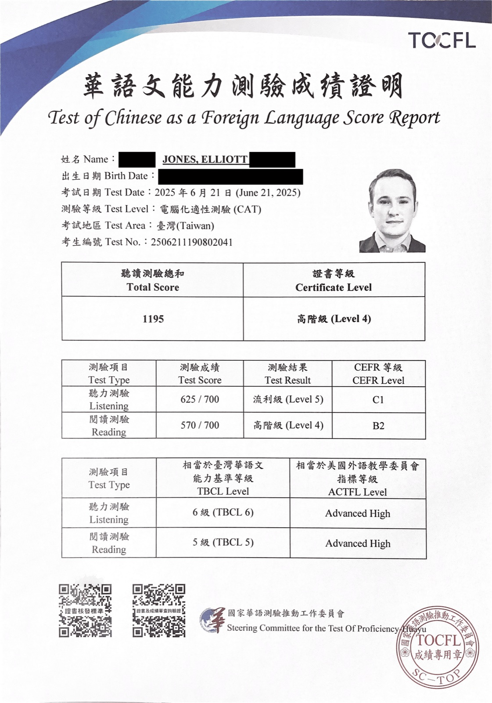
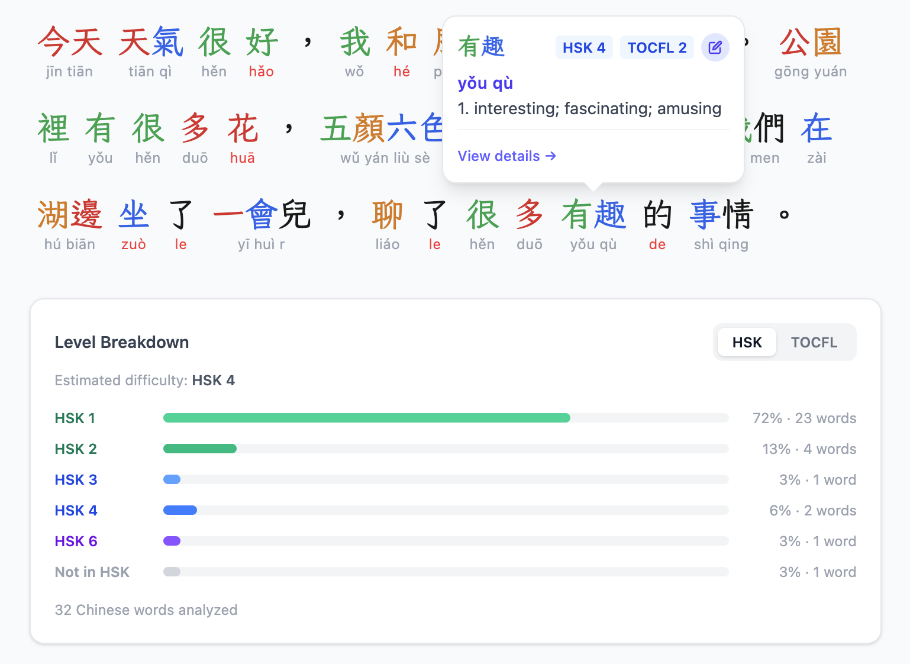

我沒上過中文課，也沒請過家教。我的中文全是在教室以外學來的；更準確地說，在我自己摸索出一套做法以前，幾乎談不上有什麼系統。這篇想分享的，就是我一路走來覺得最有用的事。

## 我的成績，以及它們代表什麼

教育部辦的華語文能力測驗（TOCFL），我考過不只一次。

| 技能 | 分數      | TOCFL 等級      | CEFR | ACTFL         |
| ---- | --------- | --------------- | ---- | ------------- |
| 聽力 | 625 / 700 | 第5級 · 流利級  | C1   | Advanced High |
| 閱讀 | 570 / 700 | 第4級 · 高階級  | B2   | Advanced High |
| 口說 | 24 / 30   | 第4級 · 高階級  | B2   | Advanced Low  |

<figure>

<figcaption>聽力 第5級 · CEFR C1</figcaption>

</figure>

<figure>

<figcaption>口說 第4級 · CEFR B2</figcaption>

</figure>

有兩件重要的事值得一提：

第一，我去考試時，中文其實已經能用得很順了。我有花時間熟悉題型，也建議你這麼做：這份考試有它自己的邏輯，摸清規則確實能多拿不少分。不過，我學中文從來不是為了那張證書。它只是記錄我當時走到哪裡，並不是我往前走的理由。

第二，最容易讓人誤會的是口說成績，我自己也曾經被它騙過。口說大概反而是我最有把握的一項。TOCFL 的口說很難，而且不少題目得先從螢幕上讀；閱讀較弱的人，會因此在口說題上失分，原因卻未必是口說不好。我的閱讀是短板，連帶拉低了口說的分數。

## 我浪費掉的那三年

這一段，是很多學習心得不太會提的。

剛搬到台灣後，我在很初階的程度卡了至少三年。不是進步了一大段後遇到高原期，而是根本還沒離開地面。我每天被中文包圍：店家、通勤、日常交談，卻幾乎感覺不到自己有在進步。

所以我說台灣替我完成了大半功課，這句話雖然是真的，意思卻和表面不太一樣。住在這裡很重要，但光靠人在這裡遠遠不夠。大約 2018 年，我同時發生了兩個改變：不再怕自己講起來很笨，並且開始用一套真正能執行的方式學習。我的中文才終於動了起來。

以下每一點，都是那三年繞過的遠路換來的。

## 1. 從耳朵開始

搬到台灣前大約一年，我開始用 Pimsleur。我沒把課程上完，也沒有學到多後面，但回頭看，它仍是很好的起點。

純音檔課程能先給你課本給不了的東西：嘴巴已經實際發過那些音，耳朵也已經在句子裡聽過它們。剛到台灣時，我至少能自我介紹，也能接住一段對話的前半分鐘。那離流利還很遠，但基礎本來就不必很大。

不用勉強自己一定要把它上完。把它當成跑道就好，不是目的地。

## 2. 願意出糗：這才是關鍵

如果這篇文章只能記住一件事，我希望就是這一點。它正是我前面三年，和後來幾年之間最大的差別。

只會一百個字，也可以跟人聊幾句。對你很辛苦，坦白說，對方也得多費點心。他們會等你慢慢湊句子；你會講得不太對，對方仍然猜得出來；有時候明明很認真，結果講成笑話。

這些都沒關係。重要的是，那段對話真的發生了，是用中文，而且是你親自開口說出來的。

我以前整整三年都在躲這種尷尬，心想等中文再好一點就敢講了。但事情的順序剛好相反：不是先講好才開口，而是得先容許自己講得很爛一陣子。那不是副作用，那就是學會說的過程。

## 3. 用你已經會的詞，把不會的詞釣出來

這是我養成過最划算、效果也最好的習慣。

遇到不會的詞時，我不急著拿手機查，也不改說英文。我會用手上已有的中文換個方式描述。比方說想說「房東」卻想不起來，就說「我租的房子的主人」。

十之八九，對方會立刻接上正確的詞。你不用特地問，他也會在最剛好的情境裡補給你。

這個小動作一次做到三件事：對話繼續留在中文裡；你練習用有限的資源把意思說清楚——而流利其實很大一部分就是這個能力；新詞也和一個具體情境綁在一起。自己費力釣出來的詞，通常比單字表上的詞記得牢得多。

接著把它存下來。這就來到下一點。

## 4. 當下先存，之後再整理

我用兩個工具做兩件不同的事。把它們拆開，才有辦法長久做下去。

**在外面時，我用 Pleco。** 對話裡剛學到的詞、今天辦事需要的說法、晚上想跟老婆說的一句話，查到以後就存起來。只花幾秒鐘，不多做別的。

**坐到電腦前，我用 Anki。** 有空時再把先前存的內容做成卡片，每天複習。

做卡片是坐在桌前才適合做的事，生活不是。站在店裡還想在手機上做出一張好卡片，結果通常不是卡片做得隨便，就是乾脆放棄。當下把資料輕鬆收好，之後再認真加工，阻力才會小。

這也表示我的單字都從自己的生活來：工作、跑腿、婚姻，不是詞頻表。現成牌組教的是別人的字彙；你自己在生活裡挖到的，才是你馬上用得上的詞。

## 5. 讓卡片對應你要練的能力

一張卡片只考一件事。正面只放這項能力真正要面對的資訊，其餘全部放背面。

| 練什麼 | 正面     | 背面                     |
| ------ | -------- | ------------------------ |
| 聽力   | 只有音檔 | 漢字、意思，想放什麼都行 |
| 閱讀   | 只有漢字 | 音檔、意思，想放什麼都行 |

規則就這麼簡單。想練聽力，就得讓耳朵先做判斷；正面先出現漢字，你其實是在讀，沒有真的聽。想練閱讀，漢字也必須單獨出現。

道理寫下來很直白，但我看過的大部分牌組都沒有這樣設計。

## 6. 先別急著學認字

我一直到聽、說都很流利以後，才刻意開始學閱讀。等於有大約五年，我幾乎沒有專門練認字。

我不後悔，原因有兩個。

第一，漢字是許多自學者最早卡住的地方。一開始就卡住，最可惜的是會失去真正帶來進步的東西：對話。聽和說會在人與人的往來中越滾越大；閱讀不會，沒人會因為你的識字量來找你聊天。

第二點連我自己都很意外。等我開始讀的時候，底子其實已經有不少了。招牌、菜單、捷運廣播、訊息串和商品標示，五年下來不知不覺讓我認得許多高頻字，完全沒特別坐下來背過。原來我早就在日常裡零星地讀了。

晚一點開始閱讀，不等於永遠不碰閱讀。只要住在文字隨處可見的地方，環境會慢慢、免費地替你做一部分功課；你則能先把心力放在開口上。

## 7. 真的開始讀的時候，從低到有點難為情的程度開始

後來我認真練閱讀，用的是 Du Chinese。我從最低等級開始，明明遠低於當時的口說程度，還是一路讀到 Advanced。

一開始讀比自己程度低的內容，前一週很容易覺得浪費時間。其實不是。就算口說已經不錯，閱讀仍然是初學者的程度；分級讀物可以讓兩項能力慢慢靠攏，不用一邊查字典、一邊硬啃小說。口說流利在閱讀上唯一能幫忙的，就是讓你前幾關過得比較快。

至於繁體和簡體，我從來沒有刻意學過簡體。我的簡體閱讀明顯不如繁體，但也夠用了。如果你在台灣，先把繁體學好，簡體自然會在別處慢慢出現；大多時候確實如此。

## 8. 耳朵撐得住之後，就餵它

聽力到了還不錯的程度後，我開始大量聽 Podcast。後面那段進步，有很大一部分就是這樣累積出來的。

先後順序很重要。初期直接聽母語者語速的內容，幾乎沒有價值：聲音切不成句子，只是一團噪音，聽一小時也吸收不了什麼。不過過了某個門檻，情況會翻過來。長篇、給母語者聽的內容會成為最有效率的輸入，因為數量多、不花錢，而且本來就是面向成人在說話。

還在初期的話，不用硬逼自己。如果已經越過中段，這很可能是你一天中收穫最多的一小時。

## 9. 你大概不需要學手寫

這是我唯一真正後悔的一件事：我花了好幾個月練一項如今已經完全失去的技能。

我曾經學手寫漢字，後來停了，也幾乎沒有用到，最後忘得差不多了。即使我每天都在中文工作環境裡，也想不起上一次手寫真的派上用場是什麼時候。

打字才是日常主力。無論用拼音或注音輸入法，你需要的是「認得出來」，不是「徒手寫得出來」：先打出讀音，再選對字。每花一小時練筆順，就少一小時練你每天可能做上萬次的事。

有人單純喜歡手寫，這當然是很好的理由。只是別把它當成必經的語言技能。

## 10. 學聲音，不是學編號

要我直接說出一個詞是第幾聲，我常常答不出來，就連每天用的常見詞也一樣。你問我「買」是二聲還是三聲，我得先自己唸一遍，再猜答案。

可是我聽得到聲調，也能把它說對；別人說的是哪個詞，我通常馬上就知道，聲調正在替我完成這件事。我只是從沒把一二三四的標籤牢記在腦中，因為我學的是聲音本身，不是它的名稱。

自學建議常把大量篇幅放在聲調操練上，學到的往往是一套分類法。真正需要的是聽得出差別、也能重現差別的能力。要得到它，靠的是大量聽音檔，以及講錯時有人立刻幫你修正。這通常會很快也很樂意地發生，因為聲調一錯，常常就變成另一個真有其詞、但你完全沒打算說的字。

讓聲音進到耳朵和嘴巴裡。你不需要一輩子都記得那些編號；我就沒記住。

## 我後來做出來的工具

前面這套方法，是我拿好幾個零件一點一點拼起來的：Pleco 查詞、Anki 複習、Du Chinese 閱讀，而我負責把資料在它們之間搬來搬去。這套方法確實可行，只是每個接縫都得自己維護。

於是後來，我做了那個一直希望有人能做出來的工具：Manda Chinese。它可以在瀏覽器使用，也有 Windows 和 macOS 的原生版。

貼進任何中文內容，不論繁體或簡體，它就會變成逐詞標註的閱讀器：每個詞都有拼音、解釋、發音，以及 HSK 和 TOCFL 等級。查過的詞可以直接加入間隔重複，做成單字卡、克漏字題或整段練習。你也能用照片、EPUB 或字幕檔匯入自己的材料。這比聽起來重要得多，因為想走出分級讀物，最快的路就是開始讀你原本就想讀的東西。所有功能都能離線使用。

如果前面幾點聽起來全是令人卻步的瑣事，Manda 要解決的正是這些事。你可以到 [mandachinese.com](https://mandachinese.com) 使用，完全免費。

## 如果你沒辦法搬到台灣或中國大陸

要是我說前面十點就是全部，那是在騙人。我在台灣和中國大陸生活超過十年，工作用中文，老婆又不太能用英文溝通；相較於在其他國家利用晚上時間自學的人，這是極大的、不是靠努力換來的優勢，再好的方法也補不齊。

不過，有件事值得說：我明明擁有這個優勢整整三年，它卻幾乎沒有帶來進步。沉浸不是方法，只是源源不絕的原料；在你願意當著別人的面講得不完美，並有一套系統把當天學到的東西留下來之前，這些原料只會擺在那裡。真正屬於我的，也是別人可以帶走的，是這兩件事。

所在地是你無法花錢買到的條件；但對我而言，真正讓我進步的從來不是那一部分。
