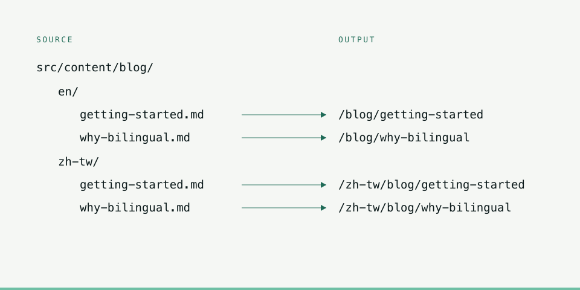

雙語網站通常長成兩種樣子：一種是有一個「真正的網站」，加上一個翻譯出來的影子；另一種是切換語言只換掉幾個標籤，內容實質上還是英文。這個站兩種都不是，理由值得寫下來。

## 兩個檔案

這裡沒有「一份基底檔加上覆寫」的做法。`content.en.ts` 和 `content.zh-TW.ts` 是兩個各自獨立、完整寫出來的物件，而且必須符合同一個介面。要加一個欄位，就得寫兩次，否則建置直接失敗。

聽起來像重複，確實是。但這是有用的那一種重複。

> 必須在各自語言裡讀起來自然的文案，並不適合用 diff 來表達。一旦把中文寫成英文的補丁，中文就會開始繼承英文的句構——而讀者看得出來。

部落格也是同樣的做法：兩個資料夾，每篇文章兩個檔案，中間隔著同一個介面。

## 哪些地方可以不一樣

不是每個地方都可以。有些屬於結構性事實，兩種語言必須完全一致，所以放在一個共用模組裡，由兩邊各自匯入——例如研討會的演講資料。如果一場演講的日期要在兩個地方各打一次，其中一個遲早會錯。

### 刻意保留英文的部分

中文版裡有幾樣東西刻意不翻：

- CYBERSEC 的演講標題。那些場次是以英文發表的，也是以英文標題被索引的。
- 英國學歷的科目名稱與成績等第。那是官方頒授的原始名稱，把成績翻成中文等於憑空造出一個不存在的資格。

### 重寫而不是翻譯的部分

其他幾乎全部。英文的自我介紹比中文長，因為同樣的意思英文需要更多字；硬要讓兩邊一樣長，只會讓一邊灌水、另一邊缺話。

## 代價

每次改動都要花真實的時間。改一個錯字是兩個檔案，加一個段落是兩個段落。另一條路——機器翻譯加上人工快速掃過——產出的中文技術上沒錯，但讀起來像制式公文；對一個整體論點就是「這個人真的做得到」的網站來說，發布那種東西實在說不過去。

## 換到什麼

兩種讀者，各自拿到一個為他們而寫的頁面。

理由就這麼簡單。
